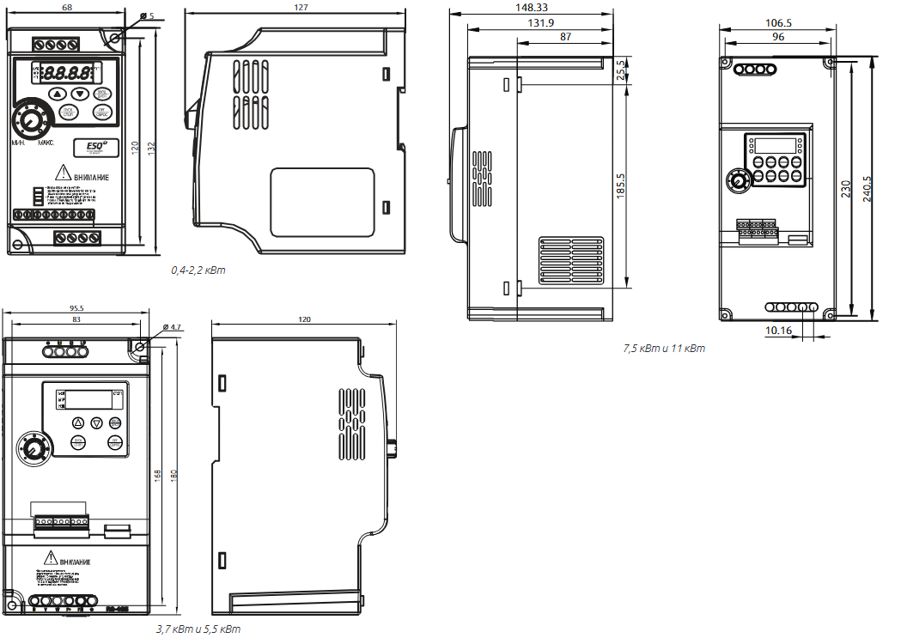
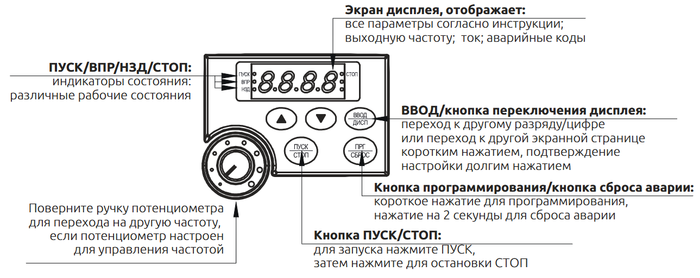
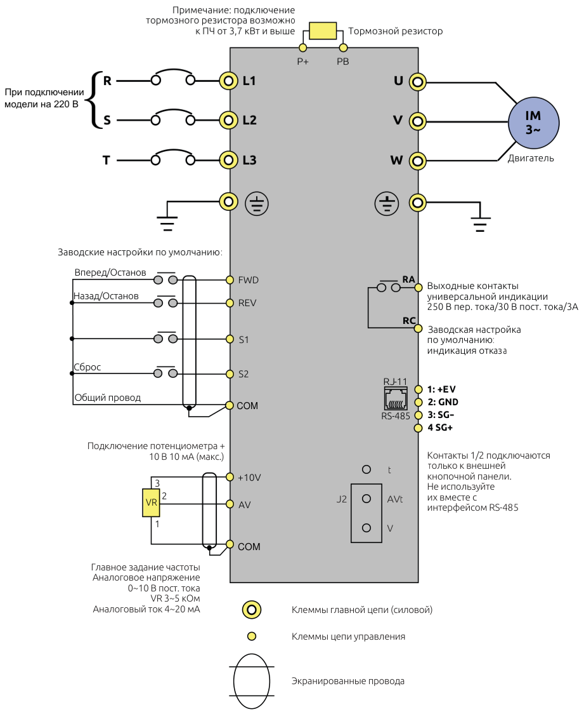

# Инструкция по эксплуатации преобразователя частоты серии ESQ-210

**[Скачать PDF-инструкцию (оригинал)](https://docs.yandex.ru/docs/view?tm=1761564268&tld=ru&lang=ru&name=ESQ210.pdf&text=%D0%A1%D0%B5%D1%80%D0%B8%D1%8F%20ESQ-210&url=https%3A%2F%2Fkontmotor.ru%2Fstorage%2Ffiles%2Fuploads%2Ffile%2FESQ210.pdf&lr=213&mime=pdf&l10n=ru&sign=6e53713aa6a29aede9e805db43d60eb9&keyno=0&nosw=1&serpParams=tm%3D1761564268%26tld%3Dru%26lang%3Dru%26name%3DESQ210.pdf%26text%3D%25D0%25A1%25D0%25B5%25D1%2580%25D0%25B8%25D1%258F%2BESQ-210%26url%3Dhttps%253A%2F%2Fkontmotor.ru%2Fstorage%2Ffiles%2Fuploads%2Ffile%2FESQ210.pdf%26lr%3D213%26mime%3Dpdf%26l10n%3Dru%26sign%3D6e53713aa6a29aede9e805db43d60eb9%26keyno%3D0%26nosw%3D1)**

## Оглавление

1. [Предисловие](#1-предисловие)
2. [Описание паспортной таблички](#2-описание-паспортной-таблички)
3. [Габаритные размеры](#3-габаритные-размеры)
4. [Описание кнопочной панели](#4-описание-кнопочной-панели)
5. [Эксплуатационные характеристики изделия](#5-эксплуатационные-характеристики-изделия) 
    5.1 [Технические характеристики](#51-технические-характеристики) 
    5.2 [Условия хранения и эксплуатации](#52-условия-хранения-и-эксплуатации)
6. [Общая схема подключения](#6-общая-схема-подключения)
7. [Параметры](#7-параметры)
8. [Подключение внешнего пульта управления](#8-подключение-внешнего-пульта-управления)
9. [Поиск и устранение неисправностей](#9-поиск-и-устранение-неисправностей)
10. [Тормозные резисторы](#10-тормозные-резисторы)
11. [Список литературы](#11-список-литературы)
12. [Приложение](#12-приложение) 
   12.1 [Скан инструкции](#121-скан-инструкций) 
   12.2 [Иллюстрации](#122-иллюстрации) 
   13.3 [Таблицы](#123-таблицы)

---

## 1. Предисловие

Благодарим вас за покупку преобразователя частоты серии **ESQ-210**.
Он предназначен для управления скоростью вращения электродвигателей малой мощности в оборудовании, таком как насосы, вентиляторы, упаковочные и деревообрабатывающие станки.[[1]](#11-список-литературы)

---

## 2. Описание паспортной таблички

- МОДЕЛЬ: ESQ-210-2S-0.75G ------------ Модель привода переменного тока
- ПИТАНИЕ: AC1PH 220V 50/60Hz 8.2A ----------- Номинальное напряжение, частота и ток питания
- ВЫХОД: AC3PH 220V ~0 ~ 400Hz 4.7A ----------- Номинальное напряжение, частота и ток на выходе
- S/N: AG0IA000001 --------------------- Серийный номер

(См. **[Таблица 1. Описание паспортных данных](#таблица-1-описание-паспортной-таблички)**).

---

## 3. Габаритные размеры

Преобразователь выпускается в нескольких типоразмерах:

- Для мощностей 0,4 – 2,2 кВт — 68×127×120 мм;
- Для 3,7 – 5,5 кВт — 95,5×168×180 мм.

(Cм. **[Рисунок 1. Габариты](#рисунок-1-габариты)**)

---

## 4. Описание кнопочной панели

Панель управления включает:

- **Дисплей** отображает частоту, ток, ошибки;
- **Кнопку ПУСК/СТОП** для управления работой;
- **Потенциометр** для задания частоты вращения.

(Cм. **[Рисунок 2. Панель управления](#рисунок-2-панель-управления)**)

---

## 5. Эксплуатационные характеристики изделия

### 5.1 Технические характеристики

| Параметр                         | Значение                                 |
| -------------------------------- | ---------------------------------------- |
| Напряжение питания               | 1 × 220 В / 3 × 380 В                    |
| Частота сети                     | 50/60 Гц                                 |
| Диапазон выходных частот         | 0,1 – 400 Гц                             |
| Метод управления                 | Пространственно-векторное управление V/F |
| Интерфейс связи                  | RS-485 (MODBUS)                          |
| Диапазон температур эксплуатации | –10 … +40 °C                             |
| Влажность                        | до 95 %, без конденсации                 |

Подробнее см. **[Таблицу 2. Технические характеристики](#таблица-2-технические-характеристики)**.

---

### 5.2 Условия хранения и эксплуатации

- Температура хранения: –20 … +60 °C
- Атмосферное давление: 86 – 106 кПа
- Не допускается установка рядом с источниками тепла или под прямыми солнечными лучами.
- Монтаж осуществляется **вертикально** на стену или DIN-рейку 35 мм.

---

## 6. Общая схема подключения

Ниже приведена типовая схема соединений (см. **[рисунок 3. Схема подключения](#рисунок-3-схема-подключения)**).
Подключение тормозного резистора доступно для моделей от 3,7 кВт.

---

## 7. Параметры

Параметры управления (группа **Pxxx**) позволяют задать:

- Источники управления (панель, RS-485, дискретные клеммы);
- Времена ускорения/замедления;
- Характеристики ПИД-регулятора;
- Защиту от перегрузки и перегрева.

Полная таблица параметров приведена в оригинальной инструкции [[1, стр. 9-20]](#121-скан-инструкций))**.

---

## 8. Подключение внешнего пульта управления

Для дистанционного управления по RS-485 необходимо установить:

- P702 = 1  (адрес устройства)
- P701 = 3  (формат передачи)
- P101 = 5  (задание частоты)
- P102 = 2  (управление пуском)

## 9. Поиск и устранение неисправностей

| Код ошибки | Причина                       | Рекомендации                              |
| ---------- | ----------------------------- | ----------------------------------------- |
| **OC1**    | Сверхток при ускорении        | Увеличить время ускорения, проверить V/F. |
| **OU2**    | Перенапряжение при торможении | Проверить тормозной резистор.             |
| **ES**     | Аварийный останов             | Освободить кнопку «STOP» и перезапустить. |

Полный список в оригинальной инструкции [[1, стр. 22-24]](#121-скан-инструкций).

---

## 10. Тормозные резисторы

| Модель           | Мощность двигателя, кВт | Сопротивление, Ω | Мощность резистора, Вт |
| ---------------- | ----------------------- | ---------------- | ---------------------- |
| ESQ-210-2S-0.75G | 0.75                    | 80               | 400                    |
| ESQ-210-4T-3.7G  | 3.7                     | 45               | 600                    |

[См. **Таблицу 3**](#таблица-3-тормозные-резисторы).
Подробнее — на [сайте производителя](https://www.elcomspb.ru).

---

## 11. Список литературы

1. ООО «Элком». *Инструкция по эксплуатации преобразователя частоты ESQ-210*. — СПб., 2020. — 26 с.
2. ГОСТ Р 7.0.100-2018. *Система стандартов по информации, библиотечному и издательскому делу. Библиографическая запись. Общие требования и правила составления*. — М.: Стандартинформ, 2018.
3. *Видеоурок: Подключение частотного преобразователя ESQ-210* Электронный ресурс. — URL: [https://rutube.ru/video/12c75d5237a8efc0ffc03c846e9a1665/](https://rutube.ru/video/12c75d5237a8efc0ffc03c846e9a1665/)

---

## 12. Приложение

### 12.1 Скан инструкций

[Оригинальный PDF-файл инструкции (скан)](./ESQ210.pdf)

---

### 12.2 Иллюстрации

#### Рисунок 1. Габариты

#### Рисунок 2. Панель управления

#### Рисунок 3. Схема подключения

### 12.3 Таблицы

#### Таблица 1. Описание паспортной таблички

| Название | Метка | Описание | Подробно |
|---|---|---|---|
| Серия привода переменного тока |  | Серия ESQ-210 | Название серии |
| Входное напряжение |  | Входное напряжение | 2S: Однофазное 220 В Диапазон изменения: -15%-20% 4T: Трехфазное 380 В Диапазон изменения: -15%-20% |
| Номинальная мощность |  | Номинальная мощность двигателя (кВт) | 0,4 ~ 3,7 кВт |

#### Таблица 2. Технические характеристики

| Параметр | Характеристики |
|---|---|
| **Источник питания** | |
| Номинальное напряжение, частота | 1 фаза 220 ~ 240 В, 50/60 Гц; 3 фазы 380 В, 50/60 Гц |
| Диапазон напряжения | 220 В: 170 ~ 240 В; 380 В: 330 ~ 440 В |
| **Выход** | |
| Диапазон напряжения | 220 В: 0~220 В; 380 В: 0~380 В |
| Диапазон частот | 0,10~400,00 Гц |
| **Метод управления** | Управление пространственным вектором напряжения по кривой V/F |
| **Индикация** | Рабочее состояние / описание сигнализации / интерактивная справка, настройка частоты / выходная частота и ток / напряжение звена постоянного тока, температура и т.п. |
| **Характеристики управления** | |
| Диапазон выходной частоты | 0,10~400,00 Гц |
| Дискретность задания частоты | Цифровой вход: 0,1 Гц, Аналоговый вход: 0,1% от максимальной выходной частоты |
| Погрешность выходной частоты | 0,1 Гц |
| Управление V/F | Настройка кривой V/F для удовлетворения разных требований нагрузки. |
| Управление моментом | Автоматическое увеличение: автоматическое увеличение крутящего момента по состоянию нагрузки; Ручное увеличение: можно увеличить момент на 0,0~20,0%. |
| Клеммы универсального входа | Четыре универсальные входные клеммы, реализуют разные функции, в том числе управление скоростью с 15 секциями, 4-секционное переключение ускорения/замедления скорости, функции Повысить/Понизить частоту, функцию аварийного останова и др. |
| Универсальная выходная клемма | 1 универсальная выходная клемма для отображения состояния работы, нулевой скорости, счетчика, внешних отказов, работы программы и другой информации и предупреждений. |
| Настройка времени ускорения/замедления | Время ускорения/замедления можно настроить по отдельности в пределах 0~999,9 сек. |
| **Другие функции** | |
| ПИД-управление | Встроенный ПИД-регулятор |
| RS485 | Стандартный интерфейс RS485 (протокол MODBUS) |
| Задание частоты | Аналоговый вход: можно выбрать диапазоны 0 до 10 В, 4 до 20 мА; Цифровой вход: Ввод с помощью потенциометра панели управления или RS485 или функции Повысить/Понизить частоту. Примечание: Клеммы АVI можно использовать для выбора аналогового входа по напряжению (0-10 В) и аналогового входа по тока (4-20 мА) с помощью переключателя J2. |
| Многокорпусной режим | Четыре универсальные входные клеммы, можно задать 15 секций скорости |
| Автоматическая регулировка напряжения | Можно выбрать функцию автоматической регулировки напряжения |
| Счетчик | 2 группы встроенных счетчиков |
| **Функции защиты/ предупреждения** | |
| Перегрузка | 150%, 60 секунд (постоянный момент) |
| Макс. напряжение | Можно настроить защиту от повышения напряжения |
| Мин. напряжение | Можно настроить защиту от снижения напряжения |
| Другие защиты | Короткое замыкание на выходе, сверхтока, блокировка параметров и т.п. |
| **Условия эксплуатации** | |
| Температура окружающего воздуха | -10°C до 40°C (без замерзания) |
| Влажность окружающего воздуха | Макс. 95% (без конденсации) |
| Высота над уровнем моря | Не выше 1000 м |
| Вибрация | Макс. 0,5 g |
| **Конструкция** | |
| Режим охлаждения | Принудительное воздушное охлаждение |
| Степень защиты | IP 20 |
| **Монтаж** | Монтаж на стене или на стандартной DIN-рейке 35 мм |

#### Таблица 3. Тормозные резисторы

| Модель | Мощность двигателя | Прерыватель | Тормозной резистор | Тормозной момент |
| :--- | :--- | :--- | :--- | :--- |
| | | | Мощность | Сопротивление | |
| ESQ-210-2S-04K | 0.4 кВт | Прерыватель отсутствует | / | / | 125 |
| ESQ-210-2S-0.75K | 0.75 кВт | Прерыватель отсутствует | / | / | 125 |
| ESQ-210-2S-1.5K | 1.5 кВт | Прерыватель отсутствует | / | / | 125 |
| ESQ-210-2S-2.2K | 2.2 кВт | Прерыватель отсутствует | / | / | 125 |
| ESQ-210-2S-3.7K | 3.7 кВт | Встроенный | 400Вт | 60-800Ω | 125 |
| ESQ-210-2S-5.5K | 5.5 кВт | Встроенный | 600Вт | 40-500Ω | 125 |
| ESQ-210-2S-7.5K | 7.5 кВт | Встроенный | 800Вт | 30-400Ω | 125 |
| ESQ-210-4T-0.7K | 0.7 кВт | Прерыватель отсутствует | / | / | 125 |
| ESQ-210-4T-1.5K | 1.5 кВт | Прерыватель отсутствует | / | / | 125 |
| ESQ-210-4T-2.2K | 2.2 кВт | Прерыватель отсутствует | / | / | 125 |
| ESQ-210-4T-3.7K | 3.7 кВт | Встроенный | 400Вт | 45Ω | 125 |
| ESQ-210-4T-5.5K | 5.5 кВт | Встроенный | 600Вт | 100Ω | 125 |
| ESQ-210-4T-7.5K | 7.5 кВт | Встроенный | 800Вт | 80Ω | 125 |
| ESQ-210-4T-11K | 11 кВт | Встроенный | 1.2кВт | 50Ω | 125 |
